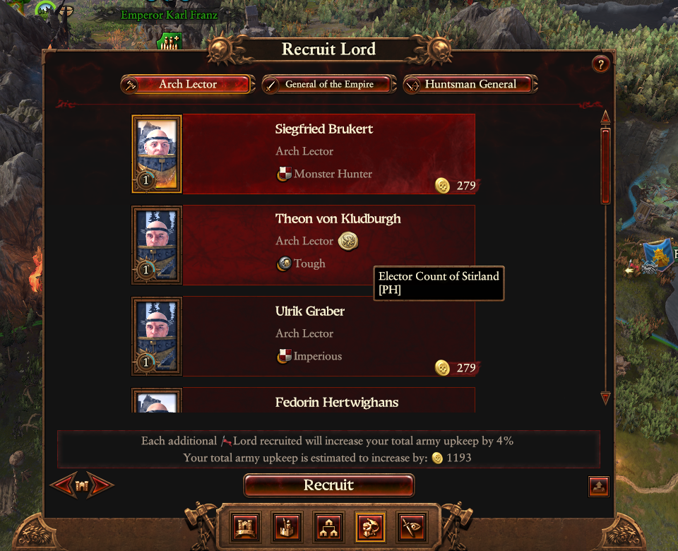
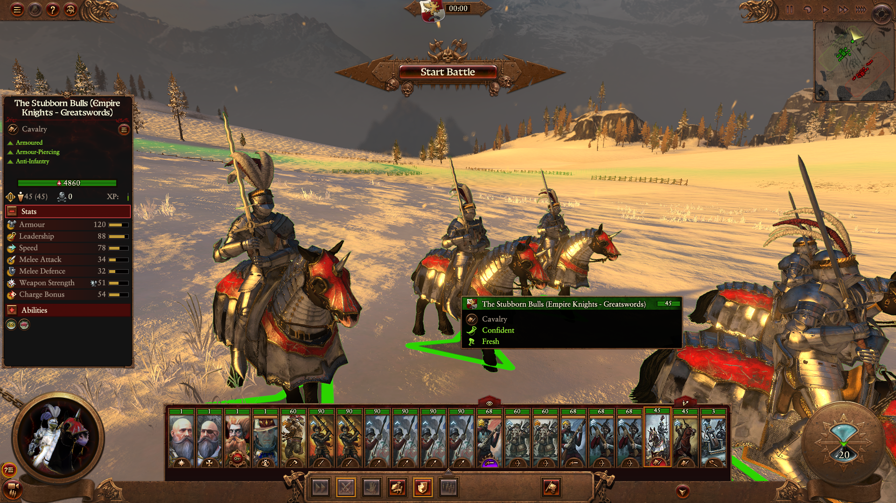
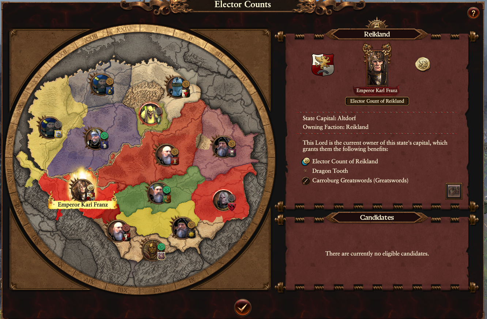
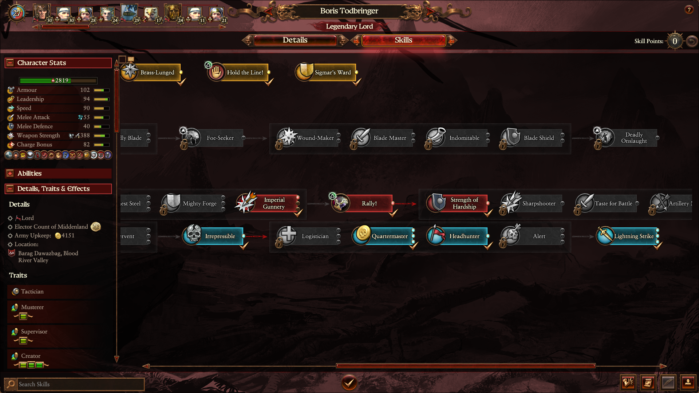
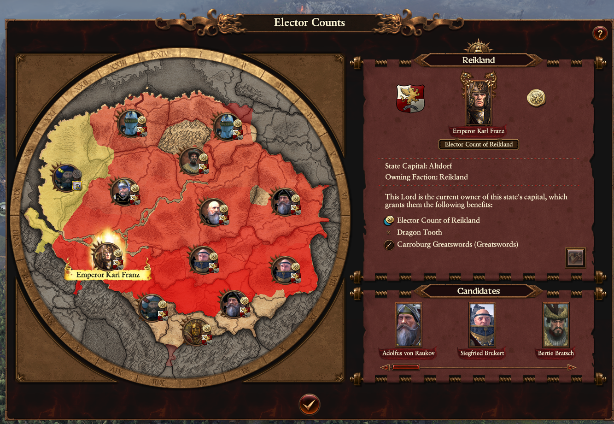
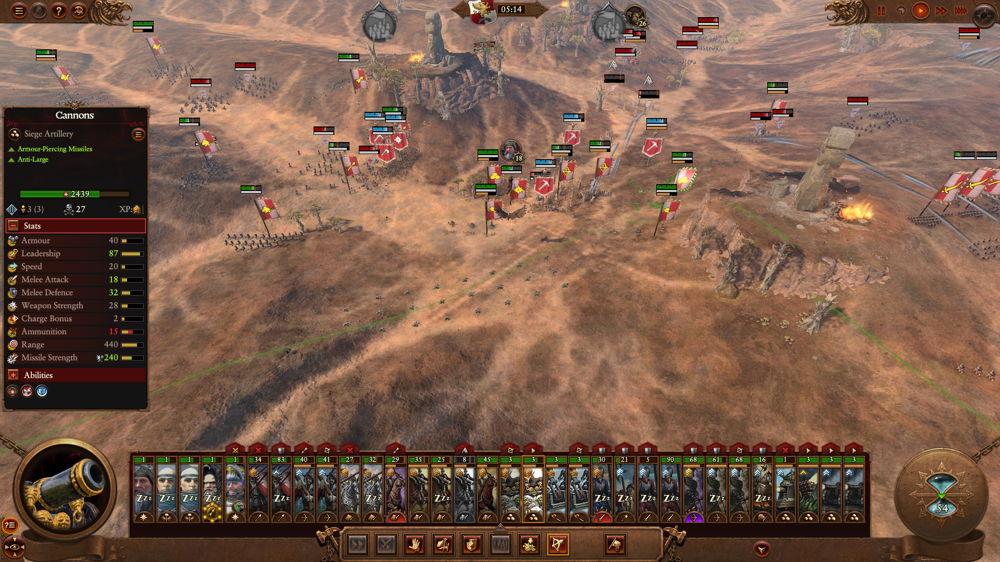
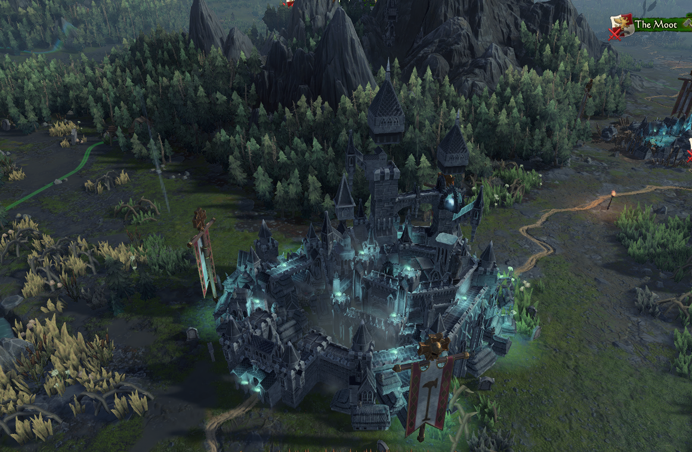

# Known bugs when playing Immortal Empires:

## Foreword

The following is a collection of bugs that I have accumulated over the last week playing immortal empires. Each section opf bugs will be split by the race by which the bug was found, and then listed in no particular order. Attached to each is an image where possible and my believed impact of the bug based on the following criteria:

1. **Minor:** Bugs that are purely cosmetic or have minimal impact on gameplay or its quality of life.
2. **Major:** Bugs that have an direct negative impact on the gameplay experience or QoL, often by forcing the player to act around it.
2. **Severe:** Bugs that render the experience severely impacted, causing a player to avoid the faction/feature until a fix is released.
2. **Critical:** Bugs that render the race/feature unplayable until a fix is released

## Empire

1. Elector count traits are not visible from the recruit lord pool, instead [PH] placeholder is present. This makes it difficult to appraciate what makes each elector unique without pinging back and forth between the elector count map and recruit menu. **Impact: Major (Affects gameplay)**

    

2. Some units do not use their correct 3d porthole (Empire knights: "Stubborn bulls" for example) **Impact: Minor (Cosmetic)**
  
    

3. On the Elector map, some  images from Warhammer 3 races do not fit their portholes properly and look squashed. In the case of Festus, you can see the squared edges of his portrait around the porthole's edge. **Impact: Minor (Cosmetic)**

    

4. Karl Franz' item set bonus is almost useless as you can't form defensive or military alliances with the empire provinces **Impact: Major (Affects Gameplay)**
    1.  You can't form defensive or military alliances with the empire provinces, including Marienburg, which is not an Elector Province. **Impact: Major (Affects Gameplay)**
5. Factions with the 'Protective' trait seem to be anything but: I have observed Karaz-a-Karak and Templehof both leaving their provinces completely undefended while they attack cities multiple provinces away, often at the cost of their own capital cities. This can compel a player to either exploit an aggressive enemy that shouldnt behave this way in the first place, or bail out an unusually aggressive ally. **Impact: Major (Affects gameplay)**
6. When a previously confederated empire province re-emerges through rebellion, attacking them lowers imperial authority as though they were still an elector count province **Impact: Major (Affects Gameplay Experience)**
7. Handgunners and other Empire line-of-sight reliant units seem to have real trouble lining up a shot in minor settlement battles, choosing to go into melee on account of a wooden fence right in front of them **Impact: Severe (Severe impact on gameplay experience)**
    1. Line of sight units cannot utilise bridges in settlement battles; they can neither shoot at or from positions on bridges. **Impact: Severe (Severe impact on gameplay experience)**
8. Boris Todbringer's blue line is mixed up. Lightning strike is his final blue skill, whilst headhunter is in the second 'tier': **Impact: Major (Affects gameplay experience)**
    
    

9. The Elector Count map has random blotches and looks incomplete. This makes sense for some places (Mordheim and Brass Keep, for example) but it looks as though the entire provinces of solland and half of Wissenland and Averland are not filled in properly. **Impact: Minor (Cosmetic)**

    

10. When an artillery unit newly is ordered to man their equipment, a move order mistakes each crewman as an individual artillery piece. **Impact: Minor (Cosmetic)**

    

11. Vampire Count major settlements (In this example, Castle Templehof) appear to have missing assets and building parts floating in mid air. **Impact: Minor (Cosmetic)**

    

## Warriors of Chaos

***WIP; Currently running a Decadent Host Campaign***