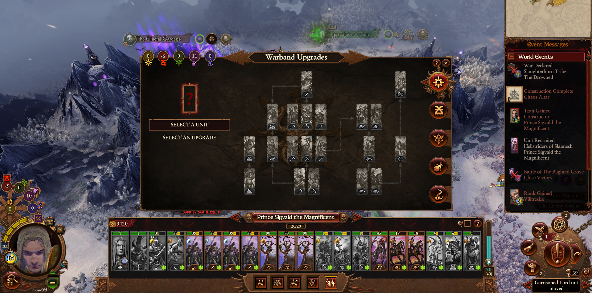
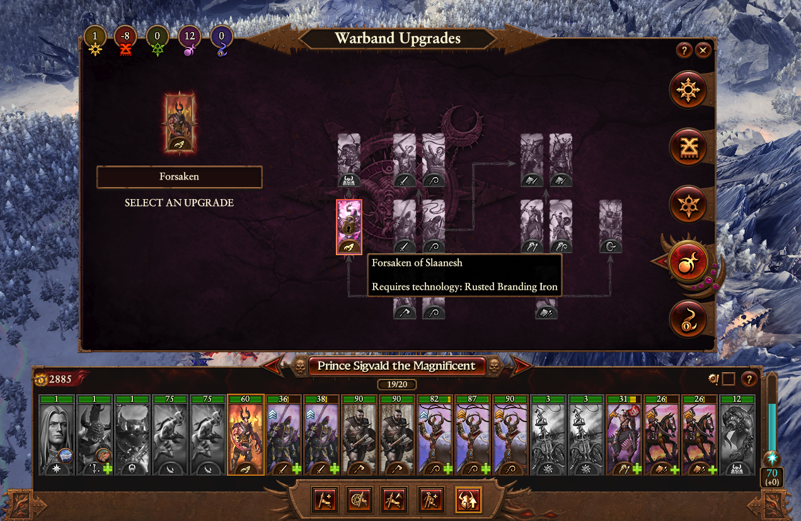
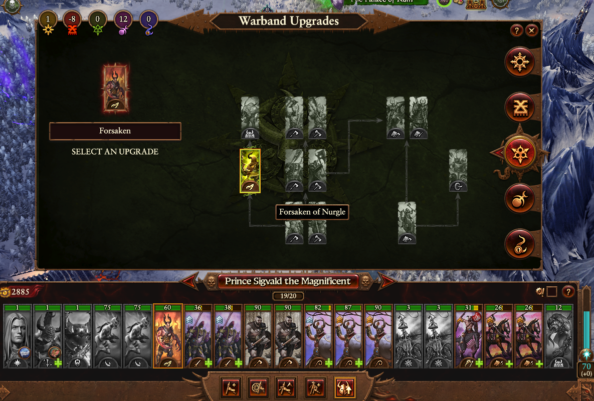
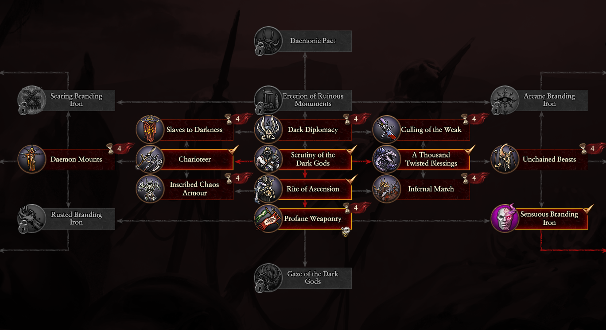
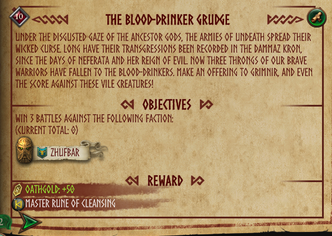
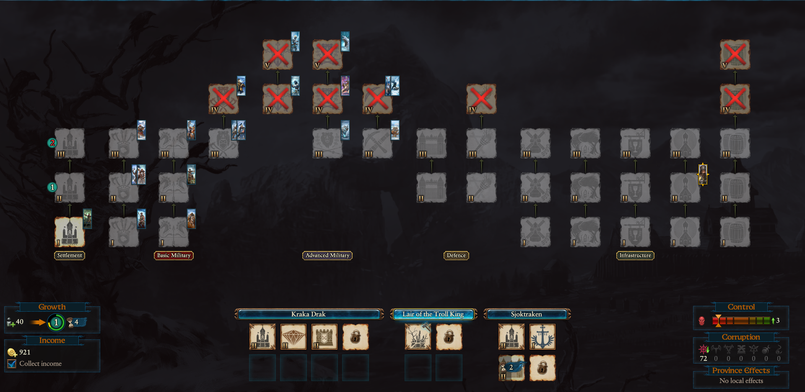
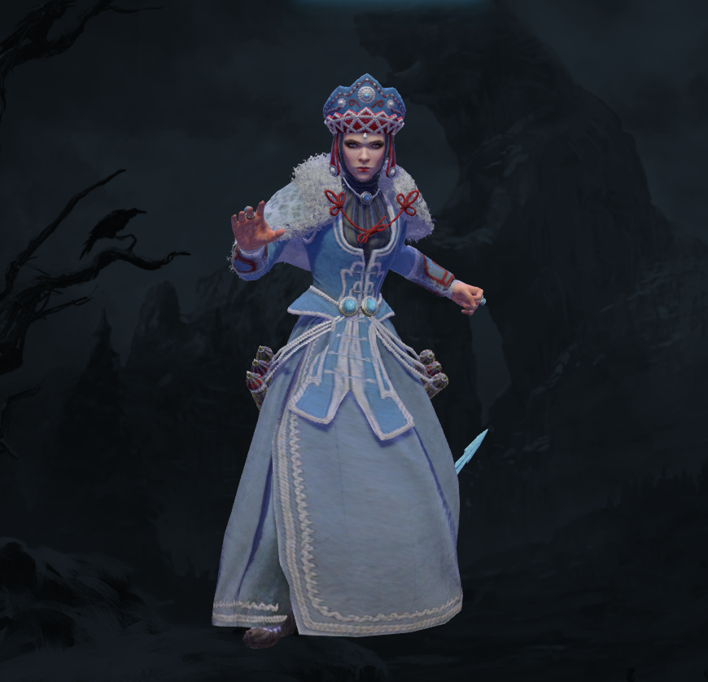

# Known bugs when playing Immortal Empires:

## Foreword

The following is a collection of bugs that I have accumulated over the last week playing immortal empires. Each section of bugs will be split by the race by which the bug was found, and then listed in no particular order. Attached to each is an image where possible and my believed impact of the bug based on the following criteria:

1. **Minor:** Bugs that are purely cosmetic or have minimal impact on gameplay or its quality of life.
2. **Major:** Bugs that have an direct negative impact on the gameplay experience or QoL, often by forcing the player to act around it.
2. **Severe:** Bugs that render the experience severely impacted, causing a player to avoid the faction/feature until a fix is released.
2. **Critical:** Bugs that render the race/feature unplayable until a fix is released

***The following bugs are found on the current IE build as of 23rd August Immortal Empires Beta release. No mods are installed.***

## Empire

1. Elector count traits are not visible from the recruit lord pool, instead [PH] placeholder is present. This makes it difficult to appreciate what makes each elector unique without pinging back and forth between the elector count map and recruit menu. **Impact: Major (Affects gameplay)**

    

    **Steps to Reproduce:**

    * Open the Lord recruit page 
    * Locate an elector count lord
    * Hover cursor over their 'Wax seal' and observe the tooltip.

    **Expected Result:**

    * A tooltip describing either flavour-text or elector count title effects is displayed

    **Actual Result:**

    * [PH] is displayed

2. Some units do not use their correct 3d porthole (Empire knights: "Stubborn bulls" for example) **Impact: Minor (Cosmetic)**
  
    

    * Recruit the Stubborn Bulls
    * Initiate a battle
    * Select the Stubborn Bulls
    * Inspect the 3d porthole

    **Expected result:**

    * The porthole should match the unit on the field (In this example, the portholed uinit should be weilding a greatsword)

    **Actual Result**

    * The stubborn bulls unit weilds the sword in one hand as though it were a regular empire knight.

3. On the Elector map, some  images from Warhammer 3 races do not fit their portholes properly and look squashed. In the case of Festus, you can see the squared edges of his portrait around the porthole's edge. **Impact: Minor (Cosmetic)**

    

    **Steps to reproduce**

    * As an imperial authority faction (Karl or Balthasar), lose an imperial region to a Wh3 legendary lord
    * Open the imperial map

    **Expected Result:**

    * The legendary lord's image fits properly in the porthole without stretching
    
    **Actual Result**

    * WH3 legendary lords do not fit, they either squash to fit, or leave edges (As seen above)

4. Karl Franz' item set bonus is almost useless as you can't form defensive or military alliances with the empire provinces **Impact: Major (Affects Gameplay)**
    1.  You can't form defensive or military alliances with the empire provinces, including Marienburg, which is not an Elector Province. **Impact: Major (Affects Gameplay)**

5. Factions with the 'Protective' trait seem to be anything but: I have observed Karaz-a-Karak and Templehof both leaving their provinces completely undefended while they attack cities multiple provinces away, often at the cost of their own capital cities. This can compel a player to either exploit an aggressive enemy that shouldn’t behave this way in the first place, or bail out an unusually aggressive ally. **Impact: Major (Affects gameplay)**

6. When a previously confederated empire province re-emerges through rebellion, attacking them lowers imperial authority as though they were still an elector count province. If you destroy the rebel faction, you recieve further penalties for supposed loss of an elector count. If you are currently using the prior elector count lord acquired through confederation, that lord will be lost as though they had died, regardless of their location at the time. This was observed when the rebellion was due to a 'rebellion' event in talabecland, and not due to public order. **Impact: Severe (Greatly affects Gameplay Experience)**

    **Steps to reproduce**

    * Confederate with an empire province
    * Recruit the former elector count of that province 
    * Trigger a rebellion within that former elector's territory by event (by public order it may or may not also have the bug)
    * Allow the rebellion to succeed and the faction to re-emerge
    * Attack and crush the rebellion

    **Expected result**

    * Imperial authority is not affected as when the faction is destroyed
    * Nothing happens to the former elector count

    **Actual result**

    * Imperial Authority suffers -2 due to empire reqion being destroyed
    * The elector count vanishes from play and must be replaced

7. Handgunners and other Empire line-of-sight reliant units seem to have real trouble lining up a shot in minor settlement battles, choosing to go into melee on account of a wooden fence right in front of them **Impact: Severe (Severe impact on gameplay experience)**
    1. Line of sight units cannot utilise bridges in settlement battles; they can neither shoot at or from positions on bridges. **Impact: Severe (Severe impact on gameplay experience)**

    **Steps to reproduce**

    * With handgunners (or other LoS reliant units), initiate a settlement battle (ideally as defender)
    * Set Fire at Will on the units
    * Place unit on a bridge looking outward to shoot units below (as though they were on a wall)#
    * Observe behaviour as units enter range

    **Expected Behaviour:**

    * Unit opens fire as enemy units enter range

    **Actual behaviour:**

    * Unit does not open fire
    * When ordered to do so, the unit begins to move off the bridge to get line of sight that they should have already

8. Boris Todbringer's blue line is mixed up. Lightning strike is his final blue skill, whilst headhunter is in the second 'tier': **Impact: Major (Affects gameplay experience)**
    
    

9. The Elector Count map has random blotches and looks incomplete. This makes sense for some places (Mordheim and Brass Keep, for example) but it looks as though the entire provinces of solland and half of Wissenland and Averland are not filled in properly. **Impact: Minor (Cosmetic)**

    

10. When an artillery unit newly is ordered to man their equipment, a move order mistakes each crewman as an individual artillery piece. **Impact: Minor (Cosmetic)**

    

    **Steps to reproduce**

    * Initiate a land battle with artillery in your army (for reproduction's sake; Dwarf cannons)
    * Have the crew Un-man the artillery
    * Have them re-man the artillery
    * Quickly drag and drop the unit formation

    **Expected Result**

    * The drag-and-drop takes the number of artillery pieces into account
    
    **Actual Result**

    * The command take the number of crew into account instead, showing far too many artillery pieces.

11. Vampire Count major settlements (In this example, Castle Templehof) appear to have missing assets and building parts floating in mid air. **Impact: Minor (Cosmetic)**

    

## Warriors of Chaos

1. Authority tracker doesn't seem to work correctly beyond a certain point: Once your authority exceeds 10, the tracker on the lord UI doesn't go any further. The tracker within the warband upgrade still works fine. **Impact: Minor (Cosmetic)**
    
    

2. Technology requirement to upgrade to marked forsaken is incorrect: The mark of slaanesh should require 'Sensuous branding iron' but instead requires rusted, which is the tech requirement for nurgle:

    

    Conversely, the upgrade for nurgle forsaken requires sensuous instead of rusted (Hence why it is available for Sigvald:)

    
    

    **Impact: Major (Affects Gameplay)**

## Dwarfs

1. Karak Kadrin has an incorrect starting Grudge: The grudge is clearly supposed to be on a vampire counts faction, but instead targets Zhufbar **Impact Major (Affects gameplay)**

    

## Kislev

1. Lair of the Troll king has no coloured UI in the building browser: **Impact: Minor (cosmetic)**

    

2. Model viewer for the Frost Maiden seems to be rendering the sword incorrectly, it is behind her rather than in her hand: **Impact: Minor (cosmetic)**

    